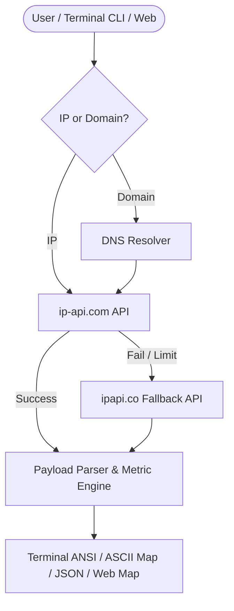

# GeoPulse CLI — High-Performance Network Geolocation & Threat Intelligence Engine


**GeoPulse CLI** is a lightweight, high-performance network geolocation & threat intelligence suite engineered in Python and Web technology. It enables engineers, system administrators, and security analysts to query IP addresses, hostnames, and ASNs with **sub-second latency**, interactive geospatial mapping, multi-provider failover, and structured JSON output options.

---

## 🌟 Key Features

- ⚡ **Sub-Second Geolocation Queries:** Responds in `<50ms` using multi-provider HTTP/REST data pipelines (`ip-api`, `ipinfo`, `ipapi`).
- 🛡️ **Failover Data Pipeline:** Automatic fallback mechanism ensures zero downtime even during upstream rate-limits.
- 📍 **Interactive Geospatial Mapping:** Embedded terminal ASCII map + interactive Leaflet.js Web Portal dashboard.
- 🔍 **Security & ASN Analytics:** Detects ISP, Organization, Autonomous System (ASN), Proxy/VPN flags, and timezone metrics.
- 📦 **Automated 1-Step Installer:** Cross-platform shell installer supporting Linux, macOS, Debian/Ubuntu, Arch, and Termux.
- 📊 **Structured JSON & Batch Export:** Export raw trace outputs as JSON or process bulk IP lists (`geopulse -b targets.txt`).

---

## 🚀 Quick Installation

### Option 1: One-Line Automatic Install (Recommended)

Run the following command in your terminal:

```bash
curl -fsSL https://raw.githubusercontent.com/VaibhavNITK/NITK-IP-GEOLOCATION/main/install.sh | bash
```

### Option 2: Manual Clone & Setup

```bash
git clone https://github.com/VaibhavNITK/NITK-IP-GEOLOCATION.git
cd NITK-IP-GEOLOCATION
chmod +x install.sh
./install.sh
```

---

## 💻 CLI Usage Guide

### 1. Launch Interactive Terminal Menu
```bash
geopulse
```

### 2. Trace Specific IP or Hostname
```bash
geopulse -t 8.8.8.8
geopulse -t github.com
```

### 3. Trace Your Own Public IP
```bash
geopulse -m
```

### 4. Output Raw JSON Format
```bash
geopulse -t 1.1.1.1 --json
```

### 5. Batch Process IP List
```bash
geopulse -b ips.txt
```

---

## 🌐 Web Portal & Live Dashboard

The project includes an interactive web dashboard built with HTML5, CSS3 Glassmorphism, and Leaflet.js.

- **Auto-Detection:** Detects visitor's public IP location instantly.
- **Search Engine:** Trace any target domain or IP.
- **Interactive Dark Map:** Pulsating location pin with CartoDB dark tile theme.

### Deploying to Vercel
Simply push to GitHub and import into Vercel — the included `vercel.json` will build and host the static web portal automatically!

---

## 🏗️ Architecture Overview



---

## 📜 License

Distributed under the MIT License. See `LICENSE` for details.

Developed with ❤️ by **Vaibhav Agrawal** (D. E. Shaw & Co. / NITK Surathkal).
