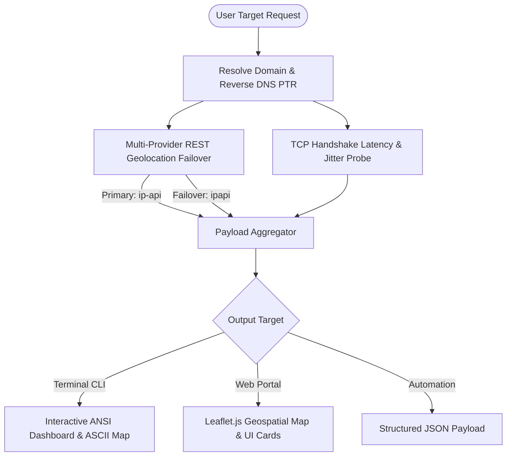

# ⚡ GeoPulse — High-Performance Network Geolocation & Intelligence Suite (CLI & Web)


🔗 **Live Web Application:** [https://geopulse-f5tx5ivbx-vaibhavnitks-projects.vercel.app/](https://geopulse-f5tx5ivbx-vaibhavnitks-projects.vercel.app/)  
📂 **GitHub Repository:** [https://github.com/VaibhavNITK/geopulse-cli](https://github.com/VaibhavNITK/geopulse-cli)

---

**GeoPulse** is a high-performance, low-latency network intelligence suite engineered for both **terminal command-line (CLI)** and an **interactive web showcase**. Built with systems engineering and networking principles, GeoPulse provides microsecond-precision TCP round-trip latency benchmarking, reverse DNS PTR resolution, BGP Autonomous System (ASN) analysis, and multi-threaded parallel IP tracing.

---

## 🌐 Dual Ecosystem: Web App & Terminal CLI

GeoPulse is designed to be showcased seamlessly across both media:

1. **🌐 Interactive Web Portal Dashboard:**
   - Real-time IP & domain geolocation search.
   - Dynamic Leaflet.js interactive dark map with custom pulsating location pins.
   - Automatic visitor public IP geolocation detection on load.
   - Deployed live on Vercel: [https://geopulse-f5tx5ivbx-vaibhavnitks-projects.vercel.app/](https://geopulse-f5tx5ivbx-vaibhavnitks-projects.vercel.app/)

2. **💻 Terminal CLI Tool (`geopulse.py`):**
   - **Nanosecond TCP Handshake RTT Benchmarking:** Calculates `Min RTT`, `Avg RTT`, `Max RTT`, and `Jitter` over active sockets.
   - **Reverse DNS & PTR Resolution:** Resolves canonical hostnames and pointers.
   - **Multi-Threaded Parallel Execution:** Traces 100+ IPs concurrently using `ThreadPoolExecutor`.
   - **Multi-Provider Failover:** Automatic fallback pipeline across primary & backup REST APIs.
   - **Structured Data Export:** Output raw trace metrics as JSON or interactive ANSI color tables.

---

## 🚀 Installation & Web Showcase

### 1. One-Line Terminal CLI Installer

Run this single command in your terminal (Linux, macOS, or Termux):

```bash
curl -fsSL https://raw.githubusercontent.com/VaibhavNITK/geopulse-cli/main/install.sh | bash
```

### 2. Live Web Showcase Deployment

The web application is live on Vercel. You can also deploy to your own Vercel or Netlify account:
- Simply import this GitHub repository (`VaibhavNITK/geopulse-cli`) into **Vercel** or **Netlify**.
- The included static configuration (`index.html`, `style.css`, `app.js`, `vercel.json`) will host the live web portal automatically!

---

## 💻 CLI Usage Guide

### Trace Target Host with TCP Latency Benchmarking
```bash
geopulse -t deshaw.com
geopulse -t 8.8.8.8
```

### Trace Your Local Public IP Diagnostics
```bash
geopulse -m
```

### Output Structured JSON Format
```bash
geopulse -t 1.1.1.1 --json
```

### High-Throughput Parallel Batch IP Processing
```bash
geopulse -b targets.txt
```

---

## 🧪 Terminal Output Demo

```
  ✔ Geolocation & Network Diagnostics Complete (324.99ms via ip-api (Primary))
  ================================================================
  Target Host              ▶  deshaw.com -> 104.18.36.211
  Reverse DNS (PTR)        ▶  N/A
  Location / Country       ▶  Toronto, Ontario | Canada (CA)
  Coordinates              ▶  43.6532, -79.3832
  Timezone                 ▶  America/Toronto
  Network Provider (ISP)   ▶  Cloudflare, Inc.
  Organization             ▶  Cloudflare, Inc.
  BGP Autonomous System    ▶  AS13335 Cloudflare, Inc.
  Active Ports Probed      ▶  53, 80, 443, 8080
  ----------------------------------------------------------------
  ⚡ Low-Latency TCP Handshake Metrics (Port 80/443):
     Min RTT: 48.165 ms | Avg RTT: 56.381 ms | Max RTT: 62.191 ms | Jitter: 14.026 ms
  ================================================================
  📍 Google Maps URL: https://maps.google.com/?q=43.6532,-79.3832
```

---

## 🏗️ Architecture Flowchart



---

## 📜 Live Links & Showcase

- **Live Web Application:** [https://geopulse-f5tx5ivbx-vaibhavnitks-projects.vercel.app/](https://geopulse-f5tx5ivbx-vaibhavnitks-projects.vercel.app/)
- **GitHub Repository:** [github.com/VaibhavNITK/geopulse-cli](https://github.com/VaibhavNITK/geopulse-cli)

---

## 📄 License

Distributed under the MIT License. See `LICENSE` for details.

Engineered by **Vaibhav Agrawal** — Member of Technical Staff, D. E. Shaw & Co. | NITK Surathkal.
